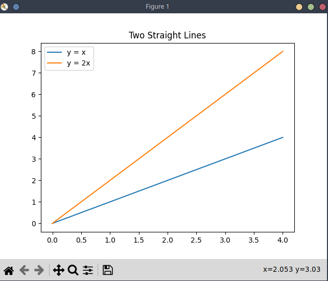

# python-docker-gui
This repository shows a way to configure Dockerfile for python development in order to have an isolated workspace for code development.

The below statements hold true for the current state of the project and it is good to familiarize yourself with them before proceeding further:
- As for now the project runs out of the box (according to the instructions below this part) on the linux platform (I personally use manjaro, but any other should work as well). For windows the project runs as well, however it does not display the graph. It is so because of the X11 display dependency which was utilized on the linux side. It will need to be fixed in some later PRs to take into account some other OS like windows, so that it can work properly regardless of the system used.
- The reason behind this small project was to develop some skills in docker technology and while doing that, make something useful out of this. I simply grew tired of mismatched settings, dependencies, python versions etc. By using docker containers, the python code should work from within the isolated container, and have all the dependencies already installed for further development.
- This is only a simple template intended to run a simple script plotting some curves with matplotlib.
- One may say that the image is of a considerable size as it is almost 1GB in size. That person would certainly make a point by saying that. I could have used base image with **slim** tag in it, which would reduce the size of underlying python image by a considerable factor, but then the python would throw a warning saying something like: **"python - _UserWarning_ Matplotlib is currently using agg, which is a non-GUI backend, so cannot show the figure."** 
This would require some workaround for it to work, but for some reason it would still not work for me after some time of trying to fix that. That is why I decided to use the bigger image which does not complain :D

## How to run this
First of all, you need to check if you have docker installed. You can do this by typing **docker version** command in the terminal.  
Secondly, you need to pull the docker image from the dockerhub. Run **docker pull thecolector/python-dev:plot-gui** to get the image from the dockerhub repo.  
Once you are done with the above, you can proceed with building the image from the Dockerfile. In order to achieve that, run the below command 
**docker build -t python-dev:default .** 
-t flag tells the docker to build the image with a name and tag. The image name is python-dev and tag is default and it comes after the colon. 
. tells the docker build command to use Dockerfile from the current directory

When the build is finished, you will need to run the **run-me.sh** shell script that wraps the docker run command along with some parameters passed to it. But before doing that, you will probably need to add execute privileges for that script in order to run it. \
Just run **chmod +x run-me.sh**. 
After that you can run the script and see the results of working script on your screen.
Image below for reference: 
 